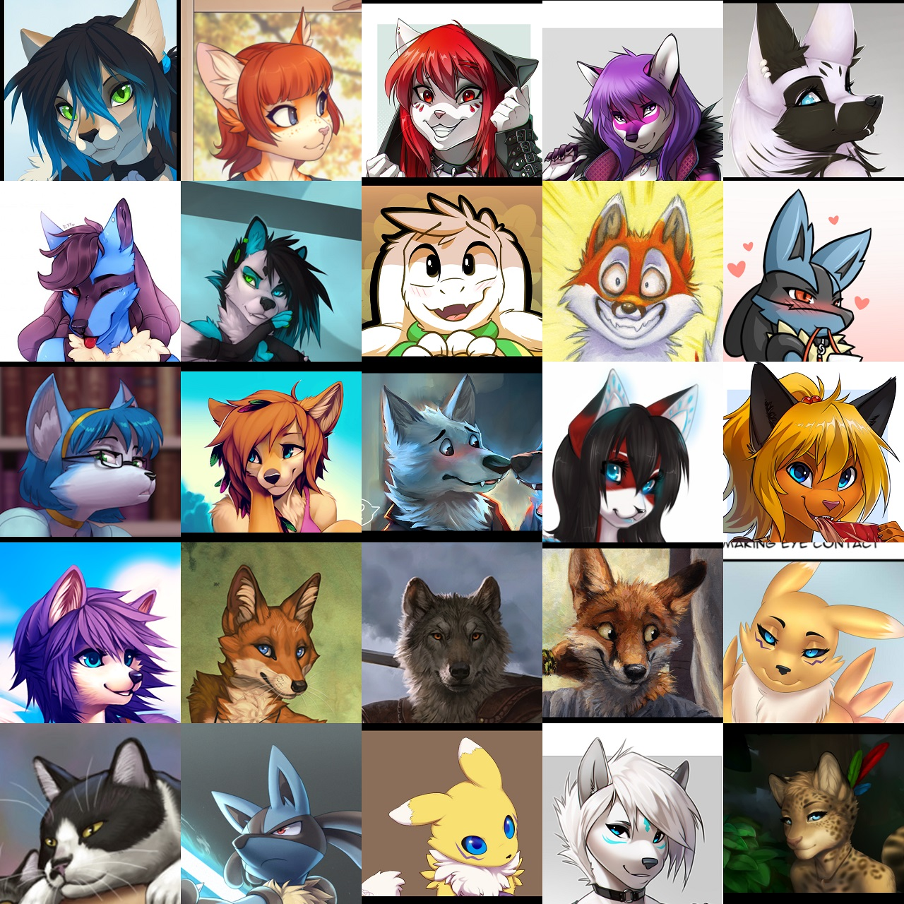

# e621 faces



Tool for getting the dataset of cropped faces from e621. It was created by training a YOLOv3 network on annotated facial features from about 1500 faces.

The total dataset includes ~186k faces. Rather than provide the cropped images, this repo contains csv files with the bounding boxes of the detected features from my trained network, and a script to download the images from e621 and crop them based on these csvs.

| File | &nbsp;
| :--- | :--------
| get_faces.py | Script for downloading base e621 files and cropping them based on the coordinates in the csvs.
| faces_s.csv | csv containing URLs, bounding boxes, and a subset of the tags for 90k cropped faces with rating=safe from e621.
| features_s.csv | csv containing the bounding boxes for 389k facial features with rating=safe from e621.
| faces_q.csv | csv containing URLs, bounding boxes, and a subset of the tags for 96k cropped faces with rating=questionable from e621.
| features_q.csv | csv containing the bounding boxes for 400k facial features with rating=questionable from e621.


## Set up environment
If you use Anaconda, you can do this to set up the env. The only requirements are `wget` and `opencv2`, so this probably isn't super necessary though. ¯\\\_(ツ)\_\/¯

```
conda env create -f e621_faces.yml
conda activate e621_faces
```

## Test on a subset of files

Before getting the full dataset, it's usually a good idea to test out the settings on a subset.

Run:

```python get_faces.py download --min-score=250 --csv=faces_s.csv --species=canine```

It should create a folder called `out` and download 14 images.

Then do:

```python get_faces.py crop --min-score=250 --csv=faces_s.csv --species=canine --square```

It should create a folder called `crop` with 17 cropped 512x512 images.

## Full dataset

The dataset from `faces_s.csv` requires ~106GB to download the uncropped images. You can pull the full `rating:s` dataset as so:

```
python get_faces.py download --min-score=0 --min-confidence=0.0 --csv=faces_s.csv
python get_faces.py crop --min-score=0 --min-confidence=0.0 --csv=faces_s.csv
```

If you're planning to train a GAN using the images, you should probably only get images with confidence >= 0.99.

## StyleGAN2

The cropped images should all be formatted correctly so that you can run the StyleGAN `dataset_tool.py` on the directory without problems.

## Training your own face detection network

You can use the crop coordinates to train a network to detect faces using [darknet](https://github.com/AlexeyAB/darknet). To do this, you would need to create a `.txt` file for each uncropped image, with the following info for each face on a new line:

`<object-class> <x_center> <y_center> <width> <height>`

and then run the training command as per the instructions in the above link.

